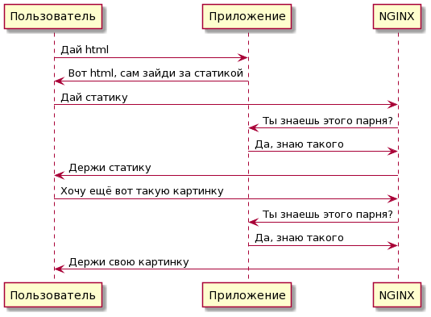
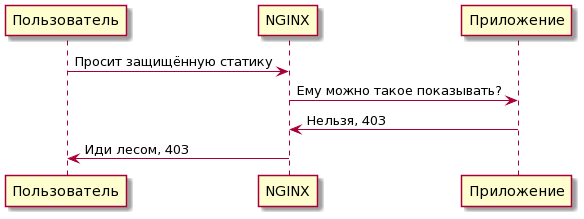

# Игрушечный репозиторий для проверки X-Accel-Redirect

Мне требуется настроить NGINX на защиту статического контента и я хочу
проводить авторизацию прав доступа через приложение. Данный репозиторий
собирает минимально необходимый набор параметров для проверки этой гипотезы.

Почитать на тему:

1. https://forum.shelek.ru/index.php/topic,30362.msg299526.html

2. https://wellfire.co/learn/nginx-django-x-accel-redirects/

3. https://www.nginx.com/resources/wiki/start/topics/examples/xsendfile/

4. https://stackoverflow.com/questions/45872539/django-and-nginx-x-accel-redirect

## Как это работает

В хорошем случае:

В плохом случае:

## Чем достигается

NGINX внутри себя делает редирект на урл приложения и готовится отдать
статический файл. Приложение должно взвести заголовок X-Accel-Redirect или
вернуть код ошибки. По пути из этого заголовка NGINX пойдёт за файлом и отдаст
его.
